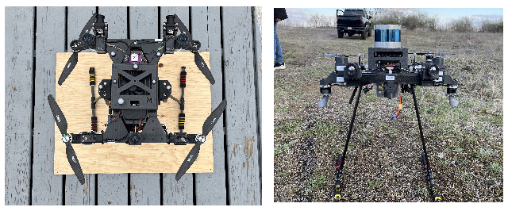
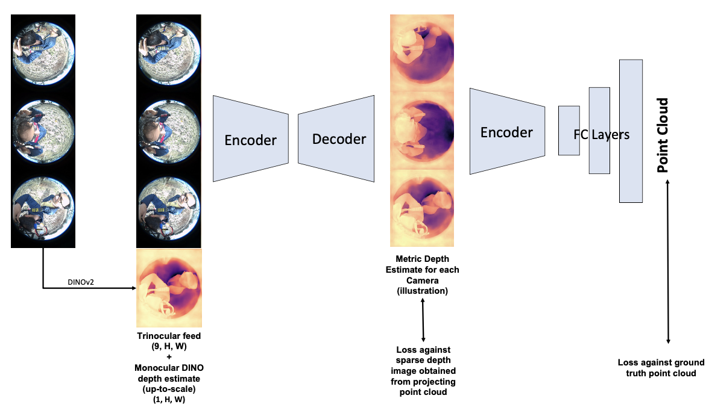
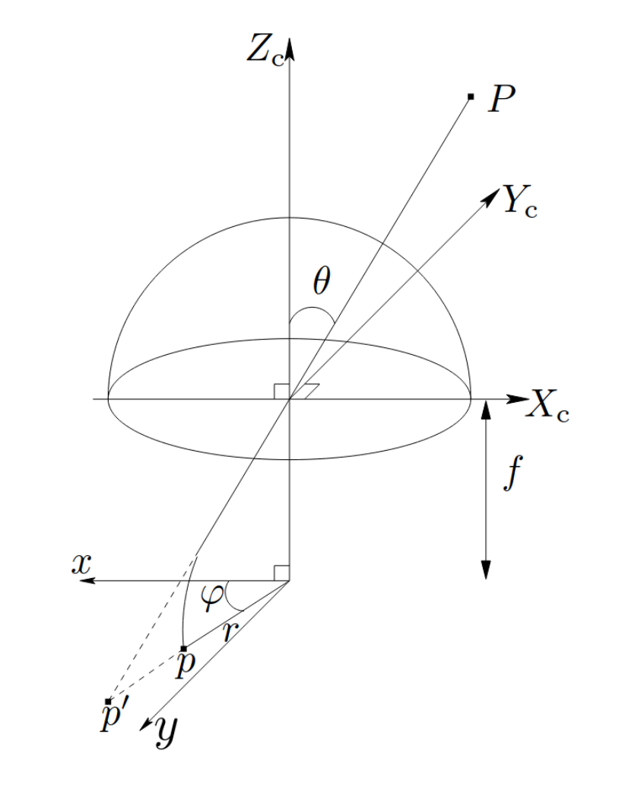
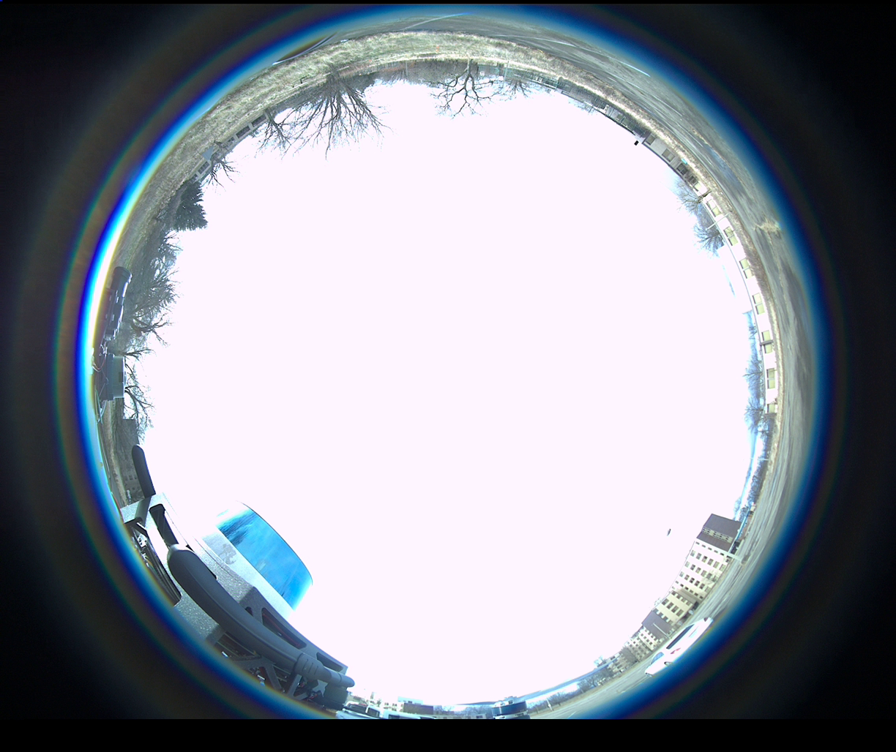
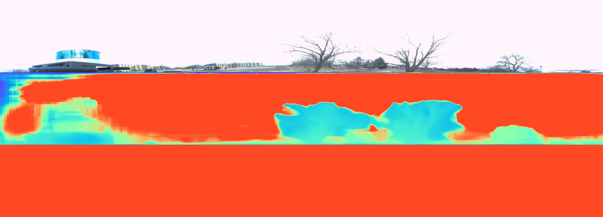
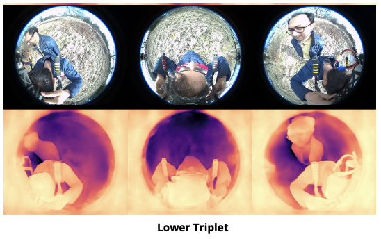
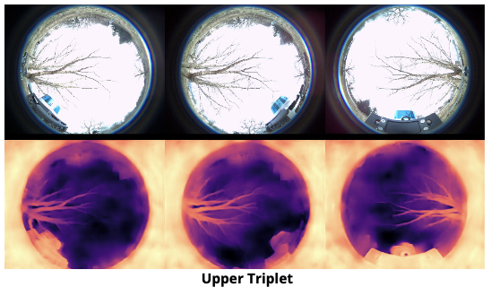

# Omnigrid: Multiview Fisheye Occupancy Grid Prediction

This blog-form illustrates what is extensively covered in the [corresponding report](https://drive.google.com/file/d/1s42BNxuo1BWgJO1owSTYkNOkcjr6JB_F/view?usp=drive_link).

> Abstract: This project aims to leverage large field-of-view (FOV) cameras to explore point cloud prediction approaches, and essentially develop a 3D perception stack for a multi-camera large FOV setup.

### Table of Contents
1. [Introduction](#introduction)
2. [Methodology](#methodology)
    1. [Data Collection and Preprocessing](#data_collection)
    2. [Metric3D as GT Depth Proxy](#metric3d)
    3. [Depth Estimation](#depth_estimation)
    4. [Point Cloud Prediction](#point_cloud_prediction)
3. [Results and Challenges](#results)
3. [Conclusion](#conclusion)

## Introduction

This project aims to leverage large field-of-view (FOV) cameras to explore point cloud prediction approaches, and
essentially develop a 3D perception stack for a multi-camera large FOV setup. The larger FOV along with multiple
cameras enables the robot to detect blind spots, which is extremely crucial for safety-critical applications. By hav-
ing multiple viewpoints, each with FOV ≈ 195◦, the same object/feature will be visible across multiple cameras.
These redundancies can help overcome problems like occlusions and variable lighting conditions, thus enhancing the
robustness of the perception stack.

Through this work, we attempt to break down the point cloud prediction task into 2 subtasks - fisheye depth prediction,
and multi-fisheye depth-to-point cloud prediction. Additionally, we explore this problem in outdoor settings. The code
can be found [here](https://github.com/WarrG3X/omnigrid).

## Methodology

For UAVs, the conventional approach is to use a multi-camera setup to have some spatial reasoning, and this is a
prevalent research direction. We do not aim to solve SLAM, 3D reconstruction, or point cloud mapping.
The project aims to predict point clouds, in a UAV-centered coordinate frame. The input to the deep learning model
will be the feed from all the fisheye cameras. The output of the model will be a point cloud of the environment.
Our model architecture is shown in the figure below. It consists of two sequential architectures. The first one predicts the
depth image from the fisheye image input. The predicted depth image is further fed into the second network, which predicts the point cloud.

### Data Collection and Preprocessing

We have collected real-world data consisting of six-fisheye images - point cloud pairs in forest environments. The data
has been collected across different forest environments in various lighting conditions. The current dataset consists of
10K+ labeled fisheye-LiDAR data.

#### Hardware Setup

Our hardware setup consists of a trinocular camera setup, with three fisheye cameras facing upward and three facing
downward. The LiDAR is placed at the center of the drone. We have performed both LiDAR-IMU calibration and
all six fisheye-IMU calibrations. The setup is shown in Figure 1. We set the trinocular configurations explicitly in a
config file.

#### LiDAR-Fisheye Projection

To obtain the ground truth depth maps (sparse) for guiding the first network, we attempt to project the collected LiDAR
data using the KB omnidirectional camera projection model. This was done by pursuing 4 approaches to validate our method:

1. We first use the fisheye abstraction in PyTorch3D, and using our calibration try to project the given 3D points to
the camera plane. However, this was not very accurate since PyTorch3D does not take the camera skew intrinsic
as input.

2. Next, we also attempt to use the OpenCV’s fisheye functionality. However, this also came with the caveat that it
could only take into account the radial distortion during projection and thus did not project very accurately.
Although not very easy to see, we notice that the points don’t exactly get projected within the
fisheye camera sphere, i.e., FOV calculations are off.

3. To verify this, we conduct a small experiment, to calculate the Jacobian of the projection w.r.t the camera
parameters. We consider 15 camera parameters - focal lengths, coordinates of the principal point, distortion
coefficients, rotation vector, translation vector, and the skew, and thus for N points in view, we get 2Nx15
dimension Jacobian. In this Jacobian, we observe that most values are of the order of 1 or 10, except the
variations of the distortion parameters, which are of the order 5,000-10,000. This tells us that the projection
model is extremely sensitive to the intrinsic calibration. We also found by manipulating the intrinsics calibration
a bit that the points did seem to converge to a more elliptical shape (we calibrate using the [kalibr](https://github.com/ethz-asl/kalibr)
package), but it was still off. As a small experiment, we change one of the radial distortion parameters from 0.2 to -0.2
(the coefficient of theta_5), the projection varies a lot [please zoom in to see results clearly].

4. Finally, we resort to implementing the omnidirectional camera model paper ourselves (shown in the figure above),
however, as mentioned above the same problem persists in calibration. We confirm this by obtaining the same
projected results in all 3 cases.
Closing this direction of effort, we decide to modify our approach a bit (in the interest of time and effort), to obtain
better ground truth.

### Metric3D as Depth GT Proxy

Due to the challenges faced in the projection of LiDAR point cloud in the fisheye camera frame, we tried utilizing the
inference from the [Metric3D](https://jugghm.github.io/Metric3Dv2/) foundation model. Since the Metric3D model is trained on pinhole-camera images,
we first undistort the fisheye images and use this to obtain the depth image. The obtained depth image has to be
distorted back to obtain a depth image corresponding to a fisheye image. However, because of inaccurate intrinsic
calibration, we are unable to distort back the inferred depth image. Therefore, the current ground truth has been
generated directly from the undistorted fisheye images. Figure 5 shows the depth image inferred from a fisheye image.
Since approximately 90% of the feed consists of sky, the part. However, the LiDAR and the trees near to the camera
can be inferred in the image.

### Depth Estimation

To improve of our depth estimation model, we employ depth estimates from the DINOv2 model as priors during
the training phase. The rationale behind this approach is that such priors can provide an initial estimate, facilitating
more accurate depth predictions. Further hypothesizing that the utilization of fisheye images from the remaining two
cameras in a triplet setup will yield superior depth estimations due to inherent redundancies, we have integrated this
strategy within our model architecture. Specifically, the model ingests concatenated triplet images along with a depth
estimate from the DINOv2 model for a singular camera, outputting depth estimates correspondingly for that camera.
The method extends to all six fisheye cameras, where the depth images, predicted in an analogous manner, are subse-
quently inputted into the point cloud prediction network.

The architectural framework for predicting depth images is structured as follows: The model processes a 10-channel
input comprising three fisheye images (each contributing three channels) from a given triplet, supplemented by a
single depth image. The encoding segment of the network features three convolutional layers, each succeeded by
a ReLU activation function and a Maxpooling layer, culminating in a flattened latent space representation. This
representation is then channeled through the decoding segment, which is composed of three deconvolutional layers,
effectively reconstructing the depth image from the encoded features

#### Depth Estimation Guidance

In this work, the depth estimation priors are derived from the DINOv2 model, specifically employing the Vision
Transformer B/14 distilled pre-trained head. Despite the DINOv2 model being primarily trained on images captured
with pinhole cameras, it demonstrates utility in guiding the depth estimation process for fisheye images. It is important
to note that the depth estimates provided by DINOv2 are scale-ambiguous and are derived solely from monocular
images. This provides a coarse initialization and enables the model to learn the metric scale efficiently.

### Point Cloud Prediction

The proposed network architecture is designed to process depth images from corresponding triplets to generate point
clouds. Specifically, depth images from the upper and lower triplets are concatenated and inputted into the network
sequentially. Subsequently, the network predicts point clouds for each triplet, which are then concatenated. The
efficacy of these predictions is evaluated by computing the loss relative to the ground truth point cloud.
Architecturally, the network manages depth images that are resized to 224x224 pixels before processing. The encoding
module of the network comprises four convolutional layers; each layer is followed by a ReLU activation function and a
maxpool layer, facilitating feature abstraction and dimensional reduction. Post convolutional processing, the encoded
features are flattened to form a coherent latent space representation, which is then inputted into the decoder.
The decoding module of the network is structured as a multi-layer perceptron (MLP), featuring layers with 1024,
2048, and 14592x3 neurons respectively. This architecture enables the network to effectively reconstruct the spatial
structure of the point cloud from the depth data input.

## Results and Challenges

At the end of the project, we were not able to completely integrate the sub-modules and fulfil the original objective
of generating a pointcloud from multiple fish-eye images. This was because we faced several challenges which made
downstream tasks even harder:

1. **Intrinsics Calibration**: Through many low-level implementations and ablations, we realized that the projection
of LiDAR to the fisheye frame (to obtain ground truth depth) was extremely sensitive to the distortion parameters
of our camera. This made calibration very crucial. Upon further investigating the source package used for
calibration (kalibr), we found out that the resolution of the calibration was not granular enough for our purpose.

2. **Sparse Data**: For our current dataset, we are using local LiDAR point clouds corresponding to our camera
feeds. However, since the point cloud is very sparse, the ground truth data is also biased toward predicting
dark outputs (One future direction that we were looking to implement is performing
LiDAR-IMU SLAM, and then using the camera poses, to project a dense point cloud instead of sparse.

3. **Model Size**: The training process was also a little heavy since the training pipeline involved loading DINOv2,
Metric3D, 6 RGB images (1028x1224), and the target point cloud. This made us resort to stochastic training
(batch size = 1). We also later resorted to pre-processing data and saving DINOv2 and Metric3D outputs, to
save training time per epoch (even though that limited data ablations). The final training time was still quite
high, at approximately 2 hours per epoch.

## Conclusion

Although the results are not promising in this pipeline, we believe the problem was broken down into solvable subtasks,
for which the networks were quite suitable.

1. The main roadblock to obtaining dense ground truth data for depth prediction remained a challenge to the very
end. To solve this we tried many techniques, from undistortion, to paper implementations, to off-the-shelf
packages (learning a lot in the process).

2. Collecting and pre-processing our own custom data proved a much harder task than we initially imagined. We
came out with an increased appreciation for the work that goes in creating and maintaining large open-source
datasets.

3. One insight we gained from this problem statement is that the choice of environment is crucial. In hindsight, a
more dense and feature-rich environment would have been a good starting point for this problem.