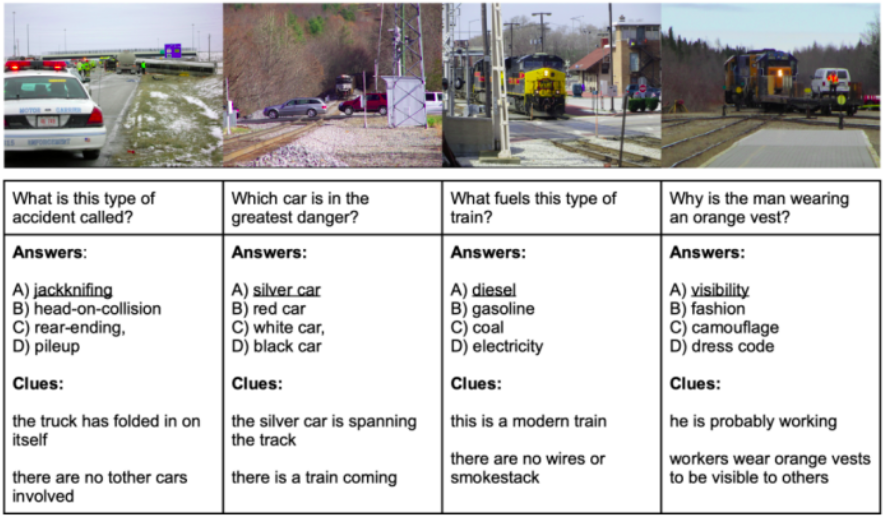

#   ROMEO: Rational Optimized Multi-task Enhancement framework for VQA

This blog-form illustrates what is extensively covered in the .

### Table of Contents
1. [Introduction](#introduction)
2. [Problem Setup and Dataset](#problem_setup)

## Introduction

In the rapidly evolving domain of autonomous vehicles (AVs), understanding and reasoning about visual scenes is paramount.
My recent work on the ROMEO framework, developed as part of a collaborative project, tackles some of the most complex challenges
in Visual Question Answering (VQA) for handling on-road anomalies. This project was also inspired by my discussion with
 during my internship at Kodiak.

### Challenges in Knowledge-Intensive VQA

Autonomous vehicles must process a diverse range of inputs, from identifying road signs in dim lighting to discerning subtle environmental cues
like animal crossing warnings or unusual traffic patterns. Current VQA systems face limitations in:

- **Advanced visual reasoning**: Struggling in low-light or occluded scenes. This will especially be highlighted in one of the qualitative comparisons below.
- **Knowledge integration**: Lacking the ability to incorporate contextual knowledge, such as identifying an unmarked pedestrian crossing.
- **Efficiency**: High computational costs hinder real-time performance. However, potential such as autolabeling can still be exploited for large-scale training.

These challenges are particularly significant for self-driving systems, where errors can compromise safety.

### Introducing ROMEO: A Rational-Optimized Framework

ROMEO (Rational Optimized Multi-task Enhancement framework) introduces innovations tailored for knowledge-intensive tasks like those
encountered in autonomous driving:

1. **Self-Refinement**: ROMEO iteratively improves its understanding by aligning visual and textual data, enabling nuanced reasoning about
complex scenes, such as determining whether a street is one-way based on visual context. This is done by introducing a novel self-refinement loss
that is used to ground the pooled image representation with the pooled text representation of the generated tokens.

2. **Multimodal Routing**: The framework dynamically selects the best visual-language model (VLM) to optimize performance and cost, crucial
for real-time applications in AVs. We explore such a best-model-selection framework to learn failure patterns across models.

3. **Rationale Generation**: ROMEO not only answers questions but also provides detailed explanations, enhancing interpretability. For
instance, it can explain why it identified a school zone sign and how it impacts recommended speed adjustments. This prediction capability
is unlocked due to our choice of the A-OKVQA dataset which also provides ground-truth (or user-annotated) rationales for each VQA sample.

### Applications in Autonomous Driving

The ROMEO framework was developed motivated by edge cases I perceived in self-driving as well as advances made in VLM technology during my summer at Kodiak:

- Enhanced Scene Understanding: Its ability to analyze and reason about objects, spatial relationships, and context ensures accurate interpretations of
dynamic environments. This can be especially highlighted by real-life examples as show in  blog.

- Real-time Decision Making: By acting as a lightweight failure pattern recognition module, the multimodal routing component optimizes
for the ideal tradeoff between processing and accuracy.

- Explainability: Inspired by a talk given by  on explainable AI for self-driving,
we explored the capability of generating rationales. ROMEO aids developers and regulators in understanding model decisions,
a step toward more transparent and accountable autonomous systems.

## Problem Setup and Dataset

### Metrics

We follow A-OKVQA authors and use the same metrics for direct comparison referencing recent work:

- **Multiple-Choice Setting (MC)**: The evaluation metric is accuracy, percentage of questions for which the model predicts the correct option.

- **Direct Answer Setting (DA)**: For each question, we have set of 10 direct answers: 1 answer is directly taken from the correct MCQ
option and 9 answers are obtained from human annotators (these 10 answers need not be unique). Following A-OKVQA and Antol et al. (2015),
we evaluate direct answers as follows: the answer generated by the model is correct only if it occurs 3 or more times in the set of direct answers.

### Compute Requirements
- **RAM Usage**: The dataset is structured as .json files, with the train index file as = 15.5MB and val = 1.0MB. Apart from this, the large and specialized vocabulary files are 100kB and 40kB respectively.
- **GPU Usage**: The GPU would hold the pretrained checkpoint, network architecture, and the batch. We expect the pre-trained ClipCap checkpoint to use 636MB of memory on the GPU. From pre-trained sources, we estimate the BERT Base model to take 6 GB and BERT Large to take 12-15 GB on the GPU. Each image in the A-OKVQA dataset is approximately 100-150kB. This makes a large batch size feasible, and will not be the GPU memory bottleneck.

Table below shows dataset statistics corresponding to the visual data from COCO 2017 dataset used for A-OKVQA.

| **Split** | **Images** |  **Size** |
|:---------:|:----------:|:---------:|
| **Train** |   17,056   | 878.09 MB |
|  **Val**  |    1,122   |  57.44 MB |
|  **Test** |    6,702   | 321.60 MB |