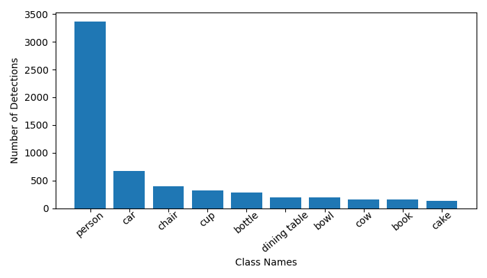
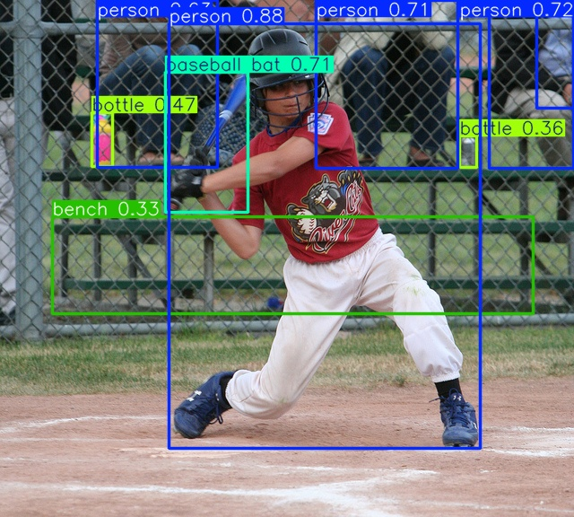
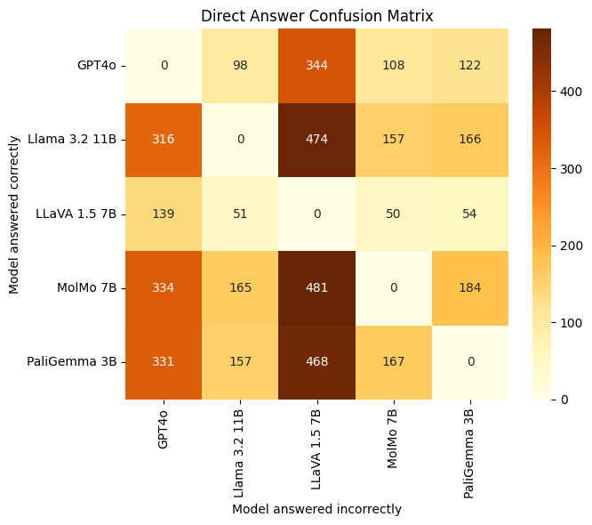
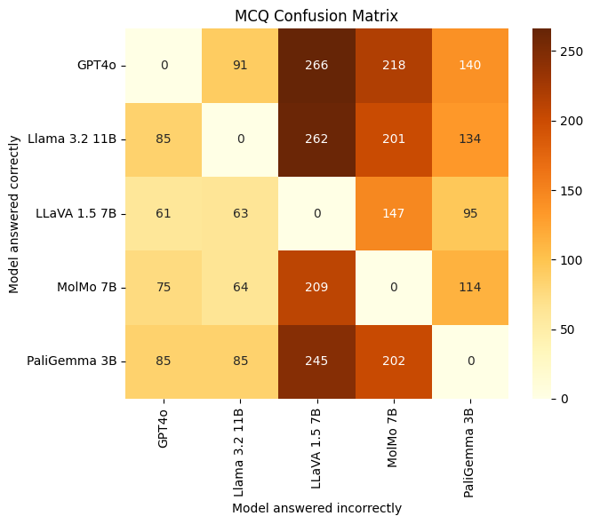
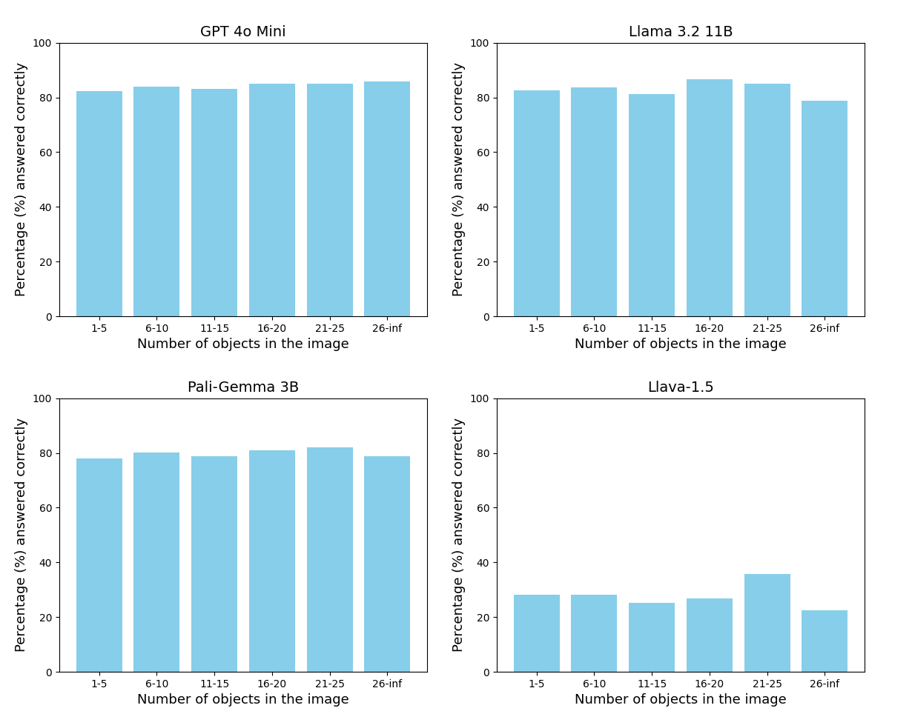
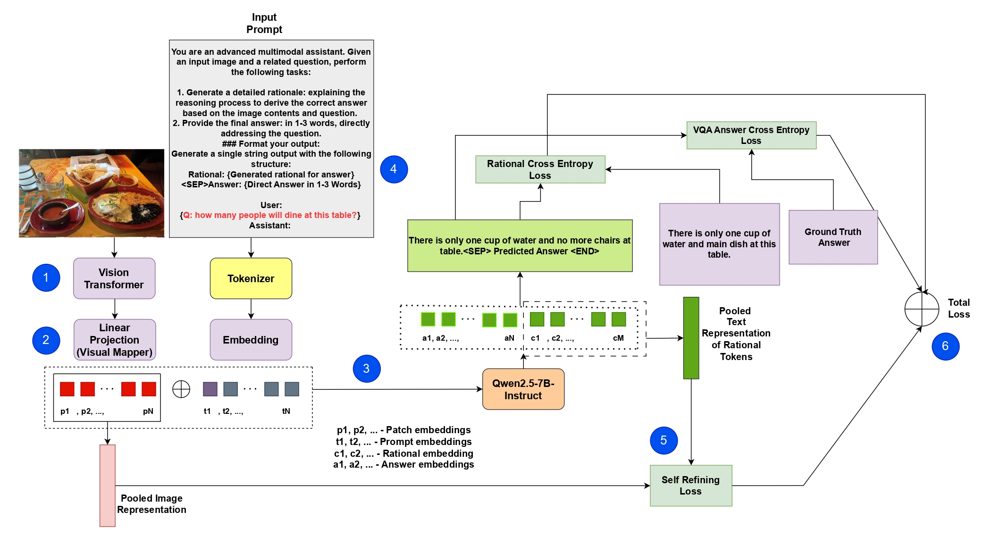
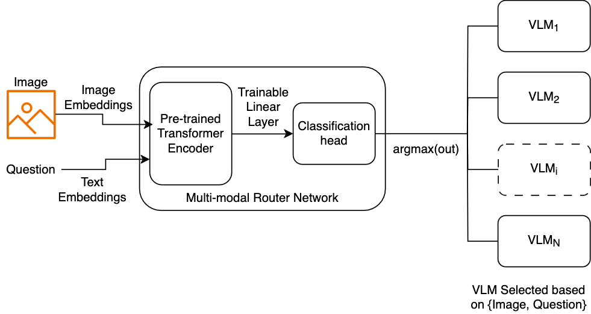

#   ROMEO: Rational Optimized Multi-task Enhancement framework for VQA

This blog-form illustrates what is extensively covered in the [corresponding report](https://drive.google.com/file/d/1uqFTfI87B7pBLKDJ96PFBSIv6MTHd5O_/view?usp=sharing).

> Abstract: This work explores
(i) a self-refinement method to ground VQA respondes to the query image (to reduce hallucinations),
(ii) a multimodal routing framework to learn failure patterns in SoTA models,
in the realm of common sense reasoning for self-driving.

### Table of Contents
1. [Introduction](#introduction)
2. [Problem Setup and Dataset](#problem_setup)
3. [Baselines](#baselines)
4. [ROMEO](#romeo)
5. [Multimodal Router](#multimodal)
6. [Qualitative Results and Theories](#qualitative)

## Introduction

In the rapidly evolving domain of autonomous vehicles (AVs), understanding and reasoning about visual scenes is paramount.
My recent work on the ROMEO framework, developed as part of a collaborative project, tackles some of the most complex challenges
in Visual Question Answering (VQA) for handling on-road anomalies. This project was also inspired by my discussion with
 during my internship at Kodiak.

### Challenges in Knowledge-Intensive VQA

Autonomous vehicles must process a diverse range of inputs, from identifying road signs in dim lighting to discerning subtle environmental cues
like animal crossing warnings or unusual traffic patterns. Current VQA systems face limitations in:

- **Advanced visual reasoning**: Struggling in low-light or occluded scenes. This will especially be highlighted in one of the qualitative comparisons below.
- **Knowledge integration**: Lacking the ability to incorporate contextual knowledge, such as identifying an unmarked pedestrian crossing.
- **Efficiency**: High computational costs hinder real-time performance. However, potential such as autolabeling can still be exploited for large-scale training.

These challenges are particularly significant for self-driving systems, where errors can compromise safety.

### Introducing ROMEO: A Rational-Optimized Framework

ROMEO (Rational Optimized Multi-task Enhancement framework) introduces innovations tailored for knowledge-intensive tasks like those
encountered in autonomous driving:

1. **Self-Refinement**: ROMEO iteratively improves its understanding by aligning visual and textual data, enabling nuanced reasoning about
complex scenes, such as determining whether a street is one-way based on visual context. This is done by introducing a novel self-refinement loss
that is used to ground the pooled image representation with the pooled text representation of the generated tokens.

2. **Multimodal Routing**: The framework dynamically selects the best visual-language model (VLM) to optimize performance and cost, crucial
for real-time applications in AVs. We explore such a best-model-selection framework to learn failure patterns across models.

3. **Rationale Generation**: ROMEO not only answers questions but also provides detailed explanations, enhancing interpretability. For
instance, it can explain why it identified a school zone sign and how it impacts recommended speed adjustments. This prediction capability
is unlocked due to our choice of the A-OKVQA dataset which also provides ground-truth (or user-annotated) rationales for each VQA sample.

### Applications in Autonomous Driving

The ROMEO framework was developed motivated by edge cases I perceived in self-driving as well as advances made in VLM technology during my summer at Kodiak:

- Enhanced Scene Understanding: Its ability to analyze and reason about objects, spatial relationships, and context ensures accurate interpretations of
dynamic environments. This can be especially highlighted by real-life examples as show in  blog.

- Real-time Decision Making: By acting as a lightweight failure pattern recognition module, the multimodal routing component optimizes
for the ideal tradeoff between processing and accuracy.

- Explainability: Inspired by a talk given by  on explainable AI for self-driving,
we explored the capability of generating rationales. ROMEO aids developers and regulators in understanding model decisions,
a step toward more transparent and accountable autonomous systems.

## Problem Setup and Dataset

### Metrics

We follow A-OKVQA authors and use the same metrics for direct comparison referencing recent work:

- **Multiple-Choice Setting (MC)**: The evaluation metric is accuracy, percentage of questions for which the model predicts the correct option.

- **Direct Answer Setting (DA)**: For each question, we have set of 10 direct answers: 1 answer is directly taken from the correct MCQ
option and 9 answers are obtained from human annotators (these 10 answers need not be unique). Following A-OKVQA and Antol et al. (2015),
we evaluate direct answers as follows: the answer generated by the model is correct only if it occurs 3 or more times in the set of direct answers.

### Compute Requirements
- **RAM Usage**: The dataset is structured as .json files, with the train index file as = 15.5MB and val = 1.0MB. Apart from this, the large and specialized vocabulary files are 100kB and 40kB respectively.
- **GPU Usage**: The GPU would hold the pretrained checkpoint, network architecture, and the batch. We expect the pre-trained ClipCap checkpoint to use 636MB of memory on the GPU. From pre-trained sources, we estimate the BERT Base model to take 6 GB and BERT Large to take 12-15 GB on the GPU. Each image in the A-OKVQA dataset is approximately 100-150kB. This makes a large batch size feasible, and will not be the GPU memory bottleneck.

Table below shows dataset statistics corresponding to the visual data from COCO 2017 dataset used for A-OKVQA.

| **Split** | **Images** |  **Size** |
|:---------:|:----------:|:---------:|
| **Train** |   17,056   | 878.09 MB |
|  **Val**  |    1,122   |  57.44 MB |
|  **Test** |    6,702   | 321.60 MB |

### Visual Modality Analysis

The A-OKVQA dataset uses images from the COCO 2017 dataset. We performed visual analysis by running object detection on the validation split
of the A-OKVQA dataset. The 1145 validation set questions make use of 1122 COCO 2017 images. We ran the YOLOV8 Small Object Detector these
images. Some statistics related number of detected objects to the images are:
- **Mean**: 8.81
- **Median**: 7
- **Mode**: 5
- **Standard Deviation**: 6.62

## Baselines

|     **Model**     |  **Method Type**  | **MCQ** | **DA** |
|:-----------------:|:-----------------:|:-------:|:------:|
|       **T5**      |      Unimodal     |  12.54  |  0.00  |
|      **GPT2**     |      Unimodal     |  20.44  |  2.02  |
|      **CLIP**     | Simple Multimodal |  22.63  |  0.00  |
|    **VilBERT**    | Simple Multimodal |  22.18  |  8.32  |
|    **ClipCap**    | Simple Multimodal |  56.93  |  30.89 |
| **Llama 3.2 11B** |  SoTA Multimodal  |  83.05  |  59.59 |
|   **Llava-1.5**   |  SoTA Multimodal  |  32.13  |  29.86 |
|    **Molmo 7B**   |  SoTA Multimodal  |  58.14  |  64.46 |
|  **GPT 4o mini**  |  SoTA Multimodal  |  83.58  |  41.33 |
| **Pali-Gemma 3B** |  SoTA Multimodal  |  77.72  |  47.16 |

We also evaluate heatmaps showing the number of questions that each model answered correctly (rows) but were answered incorrectly
by other models (columns) in both DA and MC settings.

From the heatmaps (Figures 4 and 5), we grouped the SoTA multimodal models into two categories:
- **Strong Models**: GPT4o, LLaMA 3.2 11B, and PaliGemma 3B
- **Weak Models**: MolMo 7B and LLaVA 1.5 7B

We also perform a study to analyze how the number of objects present in a scene affects the VQA perforamnce of different strong models.

We found that across models the percentage of questions answered does not get affected much by the number of objects present in the scene.

## Proposed Model: ROMEO

We present the architecture of ROMEO in Figure 1, a rational-optimized multi-task learning framework tailored for enhanced Visual Question Answering
(VQA). The core innovation lies in generating intermediate rational explanations for questions about images, which subsequently guide the model in
providing accurate answers. This rational generation enables the framework to better understand visual context and improve response accuracy. For more details on the training objective and loss function math, check out Section 5.2 in the [report](https://drive.google.com/file/d/1uqFTfI87B7pBLKDJ96PFBSIv6MTHd5O_/view?usp=sharing).

### The Vision Transformer

The pipeline begins with a vision transformer that encodes the input image into patch embeddings (p1, p2, ...), extracting essential visual features. These embeddings are then projected into the high-dimensional text embedding space using a Visual Mapper, ensuring compatibility with the LLM’s representation. Simultaneously, the Text Embedder processes the instruction prompt tokens (t1, t2, ...). These textual tokens are combined with visual features to form structured input prompts that include the instruction template and VQA question.

### The LLM

The LLM processes the input autoregressively, first generating detailed rational explanations as intermediate outputs (r1, r2, ...), and then producing the final answer embeddings (a1, a2, ...). These two stages—rational generation and answer generation—are integrated into a unified pipeline. To minimize errors and hallucinations, a self-refining loss mechanism aligns visual and textual representations while ensuring coherence in the generated explanations and answers.

### Training Objective

The training objective is formulated as a composite loss function that optimizes three interdependent tasks: rational generation (L_rationale), VQA answer generation (Lvqa), and self-refinement (L_refine). By leveraging multi-task learning, ROMEO ensures that shared representations across tasks enable more robust, contextually grounded, and generalizable model outputs. The rationale generation acts as a crucial bridge between visual understanding and accurate answering, fostering deeper reasoning capabilities.

### Performance of ROMEO on Rational Generation

|    **Method Type**    | **BLEU-4** | **ROUGE** |
|:---------------------:|:----------:|:---------:|
|         GPT 4o        |    16.47   |   44.69   |
|     Llama 3.2 11B     |    13.39   |   39.55   |
|      PaliGemma 3B     |    38.02   |   74.56   |
| ROMEO(RationalAnswer) |  **52.46** | **58.38** |

### Performance of ROMEO on Visual Question Answering

|     **Model**               |  **Method Type**  | **MCQ** | **DA**     |
|:---------------------------:|:-----------------:|:-------:|:----------:|
|       **T5**                |      Unimodal     |  12.54  |  0.00      |
|      **GPT2**               |      Unimodal     |  20.44  |  2.02      |
|      **CLIP**               | Simple Multimodal |  22.63  |  0.00      |
|    **VilBERT**              | Simple Multimodal |  22.18  |  8.32      |
|    **ClipCap**              | Simple Multimodal |  56.93  |  30.89     |
| **Llama 3.2 11B**           |  SoTA Multimodal  |  83.05  |  59.59     |
|   **Llava-1.5**             |  SoTA Multimodal  |  32.13  |  29.86     |
|    **Molmo 7B**             |  SoTA Multimodal  |  58.14  |  **64.46** |
|  **GPT 4o mini**            |  SoTA Multimodal  |**83.58**|  41.33     |
| **Pali-Gemma 3B**           |  SoTA Multimodal  |  77.72  |  47.16     |
| **ROMEO (Direct Answer)**   |  STL Multimodal   |  76.92  |  48.64     |
| **ROMEO (Rationale Answer)**|  MTL Multimodal   |**83.25**|  **63.78** |

where STL is Single Task Learning and MTL is Multi-Task Learning (since we learn the rationale as well).

## Multimodal Router

We pose model routing as a binary classification problem. Given an open-source VLM O and a proprietary VLM V, the router predicts the best VLM that for a given VQA query. While the open-source VLMs have lower inference cost as compared to the proprietary VLMs, they have weaker performance as well. Thus, to mitigate this cost-accuracy tradeoff, we want our router to capture the patterns in queries using which it makes the best possible choice of VLMs.

### Results

One limitation is that our router is designed to operate within single decision-making paradigm, such as cost or performance, rather than integrating and balancing multiple paradigms. In future work, it would be interesting to explore how we can extend our routing method to incorporate multiple decision-making paradigms. We would also explore the varying the decision thresholds effects cost-accuracy trade-offs.

Our router was trained to route prompts to either GPT-4o mini or Llama 3.2 11B such that we minimize cost while retaining performance. The router’s objective to route to the cheaper model (Llama) whenever it was correct and to route to the expensive model (GPT-4o) only in cases where the cheaper model was incorrect, but the expensive model was correct. When we created router labels for the A-OKVQA train set, we ended up with 14190 questions routed to Llama while only 1679 questions routed to GPT-4o. The number of usable training samples was not sufficient due to the class imbalance leading to a router that had nearly random performance. In future work, we plan to mitigate this by exploring data augmentation techniques and using other VQA datasets to obtain sufficient samples to train a better router.

## Qualitative Results and Theories

We observe several key patterns amongst the chosen models:

1. **Failure in Dark Images and Complex Reasoning**: Across multiple examples, models struggle with dark images and tasks requiring complex reasoning. For instance, predicting the behavior of a cat or identifying distant objects like shampoo bottles remains challenging. ROMEO shows improvement by generating rational explanations that enhance understanding, though it still faces difficulties in dim lighting conditions.

2. **Weak Models Outperforming Strong Models in Specific Cases**: In simpler scenes, weaker models such as MolMo 7B and LLaVA 1.5 7B occasionally outperform stronger models like GPT4o and LLaMA. This is often due to less complex reasoning requirements or domain-specific knowledge being less critical, allowing weaker models to perform adequately.

3. **Cases Requiring OCR, Detailed Reasoning, and Spatial Analysis**: Strong models generally excel in tasks requiring Optical Character Recognition (OCR), detailed reasoning about object interactions, or spatial analysis. ROMEO’s integration of rational generation aids in handling these complex scenarios effectively.

4. **Spatial Reasoning and Global Knowledge**: Open-source models like LLaMA and PaliGemma outperform others in tasks involving spatial reasoning or requiring global knowledge, such as identifying sports positions. ROMEO benefits from its multi-task learning approach, which supports robust generalization across diverse tasks.

### Theories for Failure Explanation
- **GPT4o**: Struggles with nuanced reasoning and spatial understanding when global knowledge or fine-grained object recognition is required.
- **LLaMA 3.2 11B**: Performs well generally but struggles with visual ambiguity and finegrained details.
- **PaliGemma 3B**: Strong performance overall but occasionally fails with external commonsense knowledge or detailed recognition tasks.
- **MolMo 7B**: Struggles with complex reasoning tasks and detailed visual analysis.
- **LLaVA 1.5 7B**: Limited ability to handle complex visual reasoning tasks.
- **ROMEO**: While ROMEO excels in generating rational explanations, it occasionally fails due to lack of specific domain knowledge, such as identifying cow breeds. It also struggles with spatial reasoning in certain scenarios, such as confusing the hour and minute hands on clocks